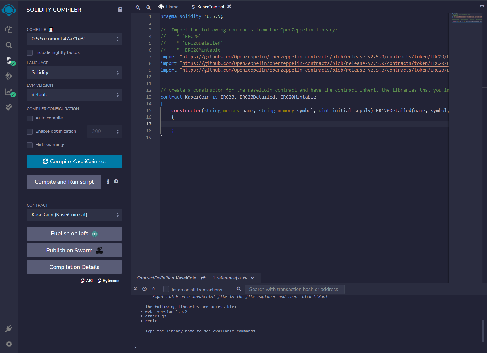
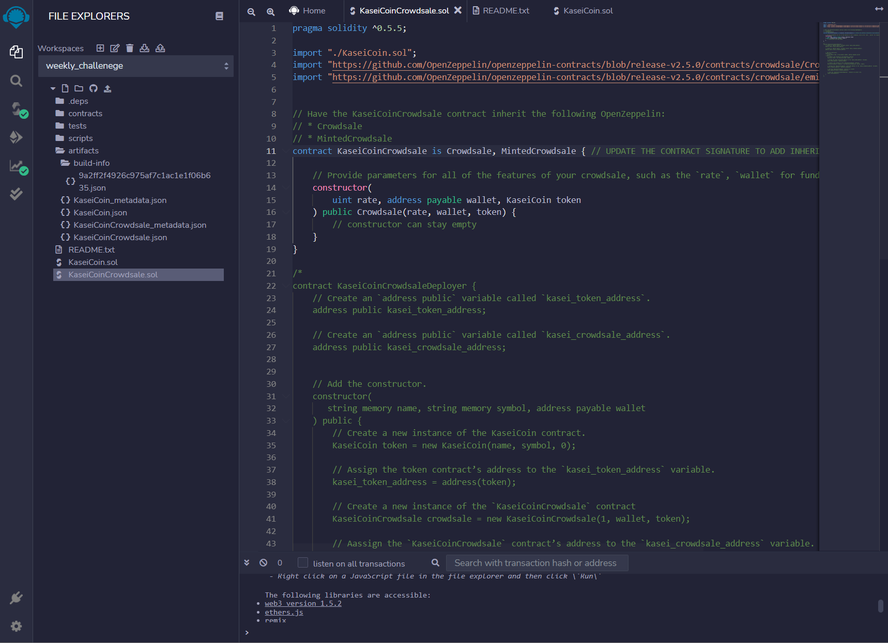

# KaseiCoin Token (ERC-20 Compliant)

This smart contract creates a token on the Ethereum Network that is ERC-20 compliant. To ensure compliance with the ERC-20 standard, the OpenZepplin library is used and classes used in token are inherited from the library.

The goal of the token is to have a crpytocurrency that will be used for the new established colony on Mars. Using cryptocurrency and the Ethereum blockchain will ensure a trustless, transparent and sound monetary policy for the people on Mars.

The new token is called KaseiCoin ("Kasei" meaning "Mars" in Japanese) to commemorate the future of humanity on Mars. 

# How to use

In order to obtain KaseiCoin, a user will have to purchase the token through a crowdsale. 

As of now, the only conversion possible is by using Ethereum or other ERC-20 compliant tokens.

When purchasing a token, ensure that the receiving address is an Ethereum addres, otherwise, the funds will be lost!

For a more detailed example on how to interact with the smart contract, see this [video](./Screenshots/kaseicoin_demo.mp4).

# Evaluation Evidence 

Below are the screenshots for various parts of the smart contract. These screenshots specify the progress made when developing the token.

KaseiCoin Compliation success:

KaseiCoin Crowdsale Compliation Success:

KaseiCoin Crowdsale Deployer Compliation Success:

